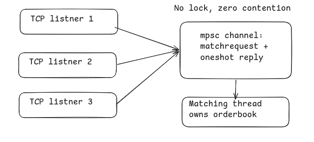

# Prediction Market Matching Engine

A toy order matching engine for a prediction market, written in Rust.

Orders are submitted through an HTTP API, matched by price-time priority inside
a single-process matching engine, and fill events are broadcast to connected
WebSocket clients in real time. Multiple API server instances can run
simultaneously without risk of double-matching.

---
## Quick start

```bash
# Terminal 1 — start the engine
cargo run -p engine

# Terminal 2 — start API server on port 3000
HTTP_ADDR=127.0.0.1:3000 ENGINE_ADDR=127.0.0.1:8000 cargo run -p server

# Terminal 3 — start a second API server on port 3001
HTTP_ADDR=127.0.0.1:3001 ENGINE_ADDR=127.0.0.1:8000 cargo run -p server

# Terminal 4 — run tests against both instances
chmod +x scripts/test.sh && ./scripts/test.sh
```
---

## HTTP API

### `POST /orders`

Submit an order. Returns the assigned ID and any fills that occurred immediately.

```bash
curl -X POST http://127.0.0.1:3000/orders \
  -H "Content-Type: application/json" \
  -d '{"side": "buy", "price": 100, "qty": 10}'
```

Response:
```json
{
  "order_id": 1,
  "fills": []
}
```

If the order matches immediately:
```json
{
  "order_id": 3,
  "fills": [
    { "maker_order_id": 1, "taker_order_id": 3, "price": 100, "qty": 10 }
  ]
}
```

### `GET /orderbook`

Returns current bids (highest first) and asks (lowest first).

```bash
curl http://127.0.0.1:3000/orderbook
```

Response:
```json
{
  "bids": [{ "price": 100, "qty": 10 }],
  "asks": [{ "price": 105, "qty": 5  }]
}
```

`WebSocket endpoint. Connect to receive fill events as they happen`

---

## Design decisions
 
### 1. How does your system handle multiple API server instances without double-matching an order?
 
**The matching engine runs as a single, separate process.** All API server
instances connect to it over TCP. Matching never happens inside an API server.
 
When an API server receives `POST /orders`, it serializes the order as a
newline-delimited JSON frame and sends it to the engine over its persistent
TCP connection. The engine processes the request, runs the matching loop, and
replies.
 
Inside the engine, a **dedicated OS thread owns the `OrderBook` exclusively**.
All TCP handler tasks send `MatchCommand` messages over an `mpsc::channel` and
receive results back through per-request `oneshot` channels. Because there is
exactly one thread processing commands — and it processes them one at a time
from the channel queue — there is no possibility of two API servers
independently deciding to match the same pair of orders.
 
```
API Server 1 ─┐
              ├──► TCP :8000 ──► mpsc channel ──► Matching thread
API Server 2 ─┘                                   (owns OrderBook,
              |                                    no lock ever)
API Server n ─┘
```
 
The invariant: **order book state lives only inside one thread inside the engine
process.** The API servers are completely stateless with respect to the book.
Any server can go down and come back up; the book is unaffected.
 
Fill events are pushed back to every connected API server over the same TCP
connection so that WebSocket clients on all servers receive every fill,
regardless of which server processed the originating order.
 
**Why a dedicated thread instead of `Mutex<OrderBook>`?**
 
A `Mutex` would also be correct for preventing double-matches — it serialises
access to the book the same way a channel queue does. The difference is
performance under load. With a `Mutex`, every TCP handler task contends for the
same lock; under high concurrency this creates a convoy of waiting tasks that
backs up the tokio executor. With a dedicated thread + channel, handlers never
contend with each other — they each send their command and suspend on their own
private `oneshot`, with zero shared-state contention. The matching thread is
also a plain `std::thread` rather than a tokio task, which keeps synchronous
CPU work (BTreeMap lookups, VecDeque pops) off the async executor entirely.
 
**Why not Redis?** Redis with a Lua script would also be correct here (Lua
executes atomically in Redis's single-threaded event loop). It is the right
production answer. For this toy, a single engine process achieves the same
isolation guarantee with fewer moving parts, no external dependencies, and
clearer ownership of the matching logic.
 
---
 
### 2. What data structure did you use for the order book and why?
 
Each side of the book is a `BTreeMap<u64, VecDeque<Order>>`:
 
```
BTreeMap key   = price tick (u64)
BTreeMap value = VecDeque of resting orders at that price, in arrival order
```
 
**Why `BTreeMap`?**
 
Price-time priority requires two operations:
 
- Find the best price instantly — lowest ask for a buy taker, highest bid for a
  sell taker.
- Remove a price level once it is exhausted.
 
`BTreeMap` keeps keys in sorted order at all times. Best ask = `.keys().next()`
(O(log N)). Best bid = `.keys().next_back()` (O(log N)). Insertion and removal
are both O(log N). No sorting step is needed at match time; the invariant is
structural.
 
A `HashMap` would give O(1) lookup by price but no ordering — finding the best
price would require a linear scan. A sorted `Vec` would keep order but make
insertion O(N). `BTreeMap` is the natural fit.
 
**Why `VecDeque` per price level?**
 
Within a price level, orders fill in arrival order (time priority). `VecDeque`
gives O(1) push to the back and O(1) pop from the front, which is exactly the
FIFO access pattern the matching loop needs. A plain `Vec` would require
shifting elements on every pop-front.
 
**Combined guarantee:** iterating `BTreeMap` gives price priority; iterating
`VecDeque` at a level gives time priority. Full price-time priority falls out
structurally with no bookkeeping overhead.
 
---
 
### 3. What breaks first if this were under real production load?
 
**The TCP connection between each API server and the engine becomes the
bottleneck.**
 
The `Mutex` bottleneck from an earlier design has been eliminated — the matching
thread owns the `OrderBook` with no locking, and handlers never contend with
each other. What remains is that every order submission, regardless of which API
server it comes from, must travel over a single TCP connection per server to the
engine, get queued in the `mpsc` channel, be processed serially by the matching
thread, and travel back. The matching thread is fast (BTreeMap O(log N), no
allocations on the hot path) but it is still one thread processing one command
at a time.
 
Concretely:
 
- At ~10 000 orders/second the `mpsc` channel inbox starts to queue up. Each
  handler's `oneshot` wait time grows with queue depth, causing latency to rise
  linearly.
- At ~100 000 orders/second the TCP send buffers between the API servers and the
  engine fill up, causing back-pressure all the way to the HTTP clients.
- The single engine process is also a single point of failure. If it crashes,
  all API servers lose their connection and the entire book is lost — there is
  no persistence and no standby.
 
The second thing to break is the `broadcast::channel` for fills. It is bounded
(1 024 slots). Under a fill storm — a large market order sweeping many price
levels — slow WebSocket clients that fall behind the channel capacity will drop
fills silently.
 
What is *not* a problem at this scale: the `BTreeMap` itself. O(log N) per
operation is fast; a book with 10 000 price levels still resolves in ~14
comparisons. Memory is also not a concern for a toy prediction market.
 
---
 
### 4. What would you build next if you had another 4 hours?
 
**In priority order:**
 
1. **Engine persistence** — the book lives only in RAM. A crash wipes all
   resting orders. A write-ahead log (append fills + resting orders to a file)
   would let the engine reconstruct state on restart. This is the most
   important missing piece for any real use.
 
2. **Order cancellation** — `DELETE /orders/:id`. Currently an order rests
   until it fills or the process dies. A cancel endpoint is the minimum viable
   addition for a real market. It maps cleanly onto a new `MatchCommand::Cancel`
   variant sent to the matching thread.
 
3. **Engine high availability** — run two engine instances with a
   primary/standby setup. The primary processes orders and replicates state to
   the standby. If the primary dies, the standby promotes. This is the correct
   answer to the single-point-of-failure problem and would also require
   persistence (point 1) to be solved first.
 
4. **Benchmarking the matching thread** — add a criterion benchmark that drives
   the `mpsc` channel at increasing rates to find the actual throughput ceiling
   and measure how latency distributes under load. This would tell us whether
   the bottleneck is the channel, the BTreeMap, or the TCP layer.
 
---

## Architecture overview



## Project structure

```
prediction-matching-engine/
├── Cargo.toml                   # workspace
├── shared/
│   └── src/lib.rs               # Order, Fill, Side, wire protocol types
├── crates/
│   ├── engine/
│   │   └── src/
│   │       ├── main.rs          # TcpListener, per-connection handler
│   │       └── order_book.rs    # BTreeMap matching engine + unit tests
│   └── server/
│       └── src/
│           ├── main.rs          # HTTP server entry point
│           ├── engine_client.rs # TCP client + push-fill listener
│           ├── state.rs         # AppState
│           └── routes/
│               ├── orders.rs    # POST /orders, GET /orderbook
│               └── ws.rs        # WebSocket upgrade + broadcast fan-out
├── scripts/
│    └── test.sh                  # end-to-end smoke tests
└── README.md
```